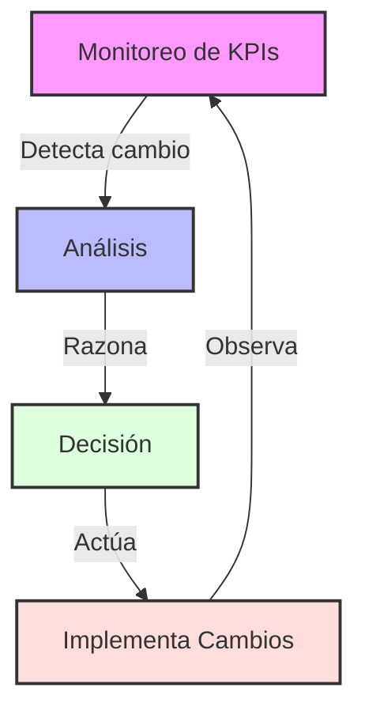
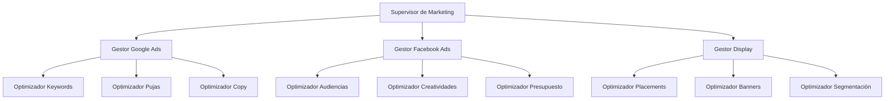
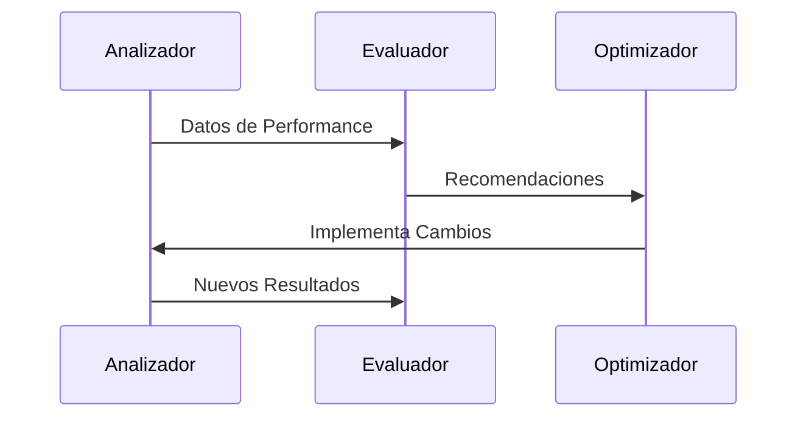
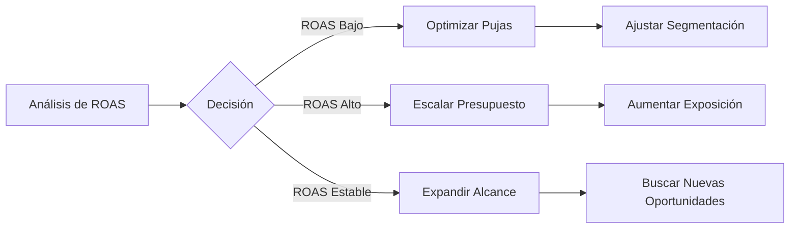
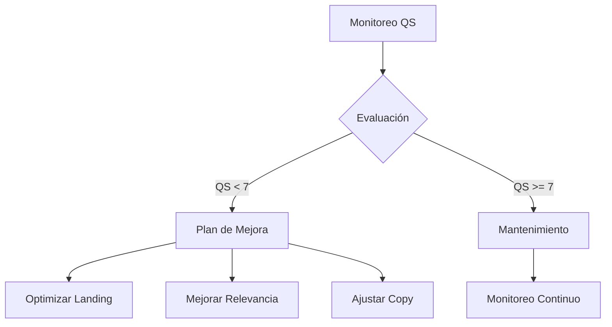
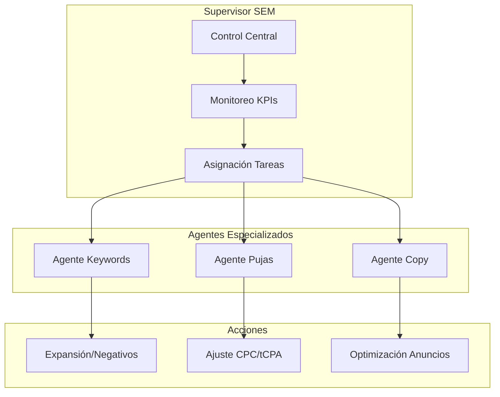
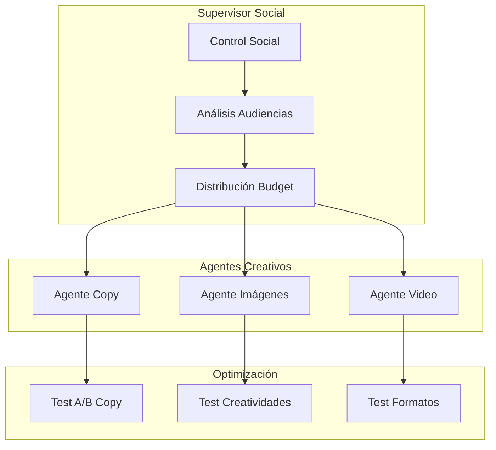
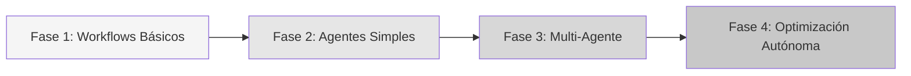
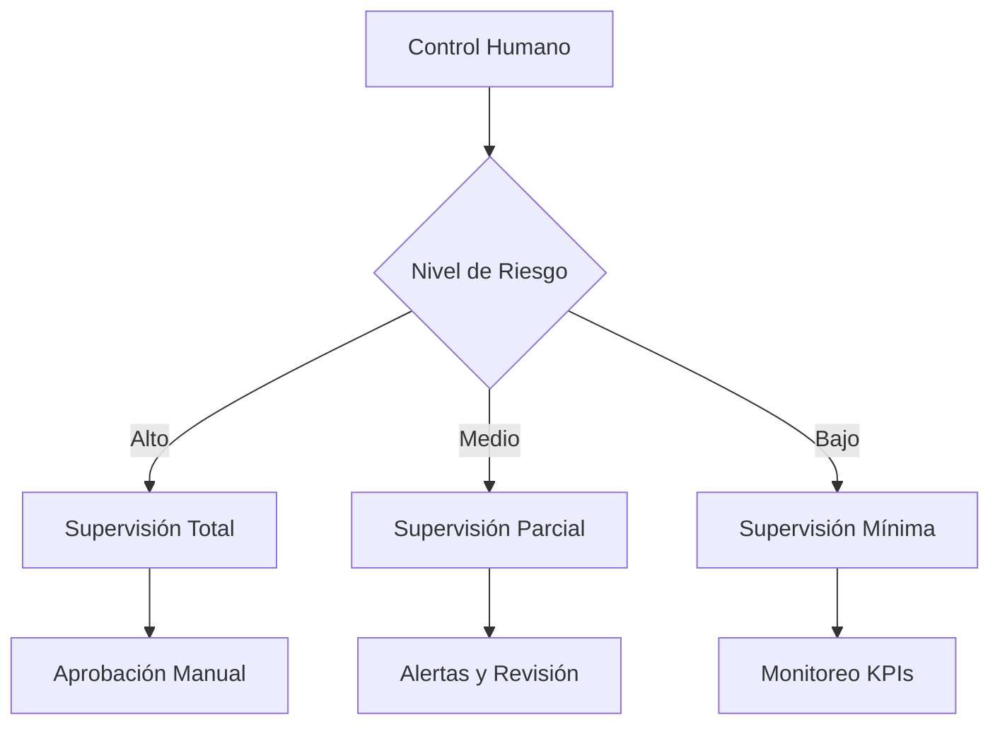

# Patrones de Diseño y Workflows para Marketing Digital

## 1. Patrones de Diseño Aplicados

### 1.1 Patrón ReAct para Optimización de Campañas

**Aplicación**: 
- El agente monitorea continuamente KPIs como ROAS, CPC, CTR
- Analiza tendencias y desviaciones
- Toma decisiones de optimización
- Implementa ajustes y observa resultados

### 1.2 Arquitectura Supervisor-Trabajadores para Multi-Canal

**Aplicación**:
- Supervisor coordina estrategias entre canales
- Cada canal tiene agentes especializados
- Optimización sincronizada de recursos
- Aprendizaje cruzado entre canales

### 1.3 Workflow de Evaluación-Optimización

**Aplicación**:
- Análisis continuo de métricas
- Evaluación contra benchmarks
- Optimización basada en feedback
- Ciclo iterativo de mejora

## 2. Workflows Específicos para Marketing Digital

### 2.1 Workflow de Optimización de ROAS

### 2.2 Workflow de Gestión de Quality Score

## 3. Arquitecturas Multi-Agente para Canales Específicos

### 3.1 Sistema de Optimización Google Ads

### 3.2 Sistema de Optimización Facebook Ads

## 4. Recomendaciones para Implementación

### 4.1 Estructura de Adopción Gradual

1. **Fase 1**: Implementar workflows básicos de optimización
2. **Fase 2**: Introducir agentes simples para tareas específicas
3. **Fase 3**: Desarrollar sistema multi-agente
4. **Fase 4**: Habilitar optimización autónoma con supervisión

### 4.2 Marco de Control y Supervisión

## 5. Factores Críticos de Éxito

1. **Definición Clara de KPIs**
   - ROAS objetivo
   - CPA máximo
   - Quality Score mínimo

2. **Límites de Control**
   - Rangos de puja
   - Límites de presupuesto
   - Umbrales de cambio

3. **Monitoreo y Ajuste**
   - Dashboards en tiempo real
   - Alertas automáticas
   - Revisiones periódicas